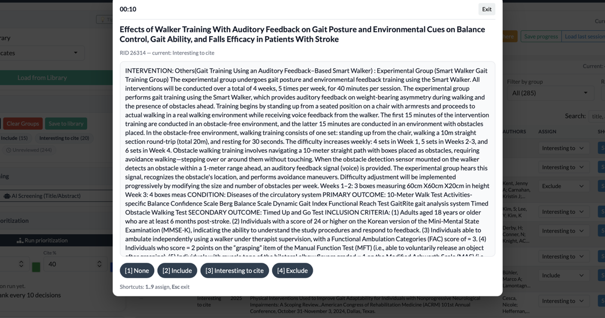
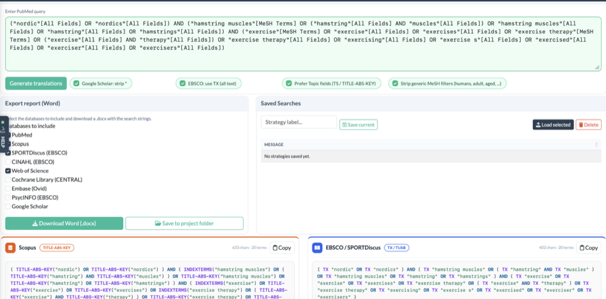
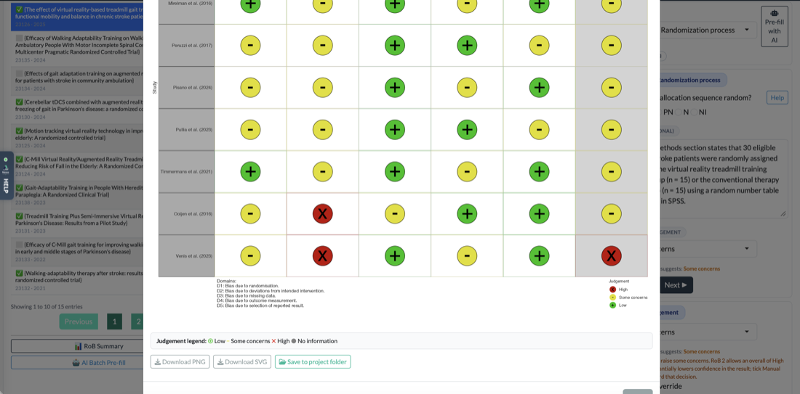
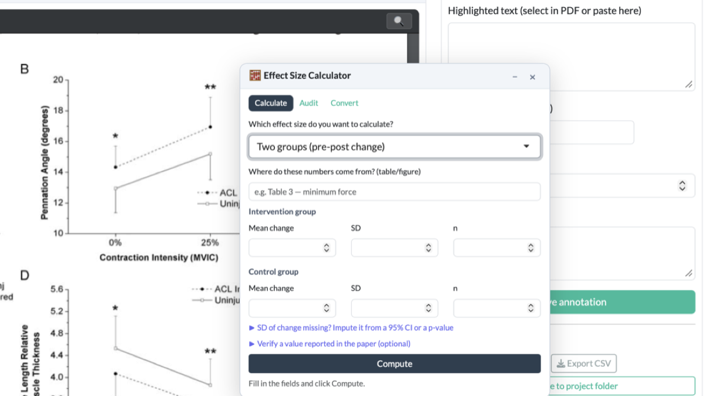
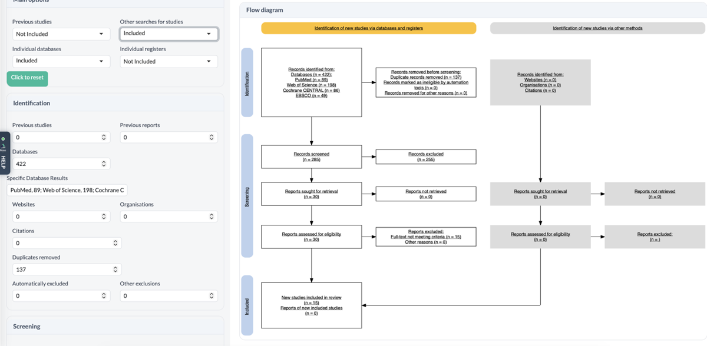

# Nexus SR

**Revisiones sistemáticas y meta-análisis, de la búsqueda al manuscrito, en tu propio ordenador.** 
*Systematic reviews and meta-analysis, from search to manuscript, on your own computer.*

 

&nbsp;

[Guía de instalación](https://dl.nexussr.org/) · [Novedades de esta versión](https://github.com/NexusSRlab/nexus-updates/releases/latest) · [Todas las versiones](https://github.com/NexusSRlab/nexus-updates/releases)

---

<b>Modo foco de cribado</b>: un artículo cada vez, decisión con una tecla

## Qué hace

Nexus SR recorre la revisión entera en una sola aplicación, sin programar. Tus proyectos se guardan en tu ordenador, no en la nube.

| Etapa | Qué tienes |
|---|---|
| **Planificar** | Pregunta PICO, criterios de elegibilidad, protocolo y objetivos del estudio |
| **Buscar** | Constructor de cadenas por bloques, traducción automática a PubMed, Scopus, Web of Science, Embase, Cochrane, EBSCO y Google Scholar, rastreo de citas y aviso de estudios nuevos en PubMed |
| **Importar** | RIS, NBIB, BibTeX y CSV, con eliminación de duplicados exacta y aproximada |
| **Cribar** | Título/resumen y texto completo, cribado asistido por IA, doble revisor con kappa de Cohen y resolución de discrepancias |
| **Leer** | Buscador de PDFs a texto completo, lector con resaltados y anotaciones, listas de lectura |
| **Extraer** | Calculadora de tamaños del efecto y digitalizador de datos de gráficas |
| **Analizar** | Meta-análisis de efectos aleatorios y de tres niveles, heterogeneidad, subgrupos, meta-regresión, sesgo de publicación, forest y funnel plots |
| **Valorar** | RoB 2, ROBINS-I, PEDro y checklists JBI con figura de semáforo; certeza de la evidencia con GRADE |
| **Publicar** | Diagrama PRISMA 2020 generado desde tus datos, citas en Word, exportación a DOCX, RIS, BibTeX y CSV, y seguimiento de envíos a revistas |

<table>
  <tr>
    <td width="50%"> <b>Polyglot Search</b>: una búsqueda de PubMed, traducida a cada buscador</td>
    <td width="50%"> <b>Riesgo de sesgo</b>: evaluación por dominio y figura de semáforo</td>
  </tr>
  <tr>
    <td width="50%"> <b>Calculadora de tamaños del efecto</b>, a mano o desde una tabla del artículo</td>
    <td width="50%"> <b>PRISMA 2020</b>: el diagrama sale de tus propias decisiones de cribado</td>
  </tr>
</table>

## Instalación

1. **Instala R 4.1 o posterior** desde [cloud.r-project.org](https://cloud.r-project.org). No hace falta RStudio.
2. **Descarga Nexus SR** con los botones de arriba: el instalador `.exe` en Windows, el `.zip` en macOS.
3. **Ábrelo.** La primera vez instala sus paquetes de R: **reserva de 10 a 25 minutos** y una buena conexión. Después arranca en segundos.

La app aún no está firmada, así que macOS y Windows avisan la primera vez. La [guía de instalación](https://dl.nexussr.org/) explica, con capturas, cómo abrirla igualmente.

> **¿Qué fichero bajo de la página de la release?** Solo `NexusSR-mac.zip` (o `.dmg`) en macOS y `NexusSR-Setup.exe` en Windows. El resto son copias y paquetes que usa el sistema de actualizaciones.

**Requisitos:** macOS (Apple Silicon o Intel) o Windows 10/11 · R 4.1+ (recomendado 4.3+) · ~1 GB libre.

## Actualizaciones

Nexus SR comprueba al arrancar si hay versión nueva y se actualiza con un clic. Cada paquete va firmado, y si algo sale mal la app vuelve sola a la versión anterior.

## Licencia de uso

Nexus SR Student Edition se usa con una licencia personal. Si estás en un curso, tu instructor te da el código de acceso; la guía de instalación explica cómo activarla.

---

<b>English</b>

 

**Nexus SR** runs the whole systematic review in one desktop app, with no coding: PICO and protocol, search strings translated to seven databases, import and deduplication, AI-assisted screening with inter-rater kappa, full-text finder and PDF reader, effect-size calculator and plot digitizer, random-effects and three-level meta-analysis, RoB 2 / ROBINS-I / PEDro / JBI with GRADE, a PRISMA 2020 diagram built from your own data, citations in Word, and a journal submission tracker. Your projects stay on your computer.

**Install**

1. Install **R 4.1 or newer** from [cloud.r-project.org](https://cloud.r-project.org). RStudio is not needed.
2. Download Nexus SR: [macOS](https://dl.nexussr.org/mac) · [Windows installer](https://dl.nexussr.org/exe).
3. Open it. The first launch installs its R packages: **allow 10–25 minutes** on a good connection. After that it starts in seconds.

The app is not code-signed yet, so macOS and Windows warn you the first time; the [install guide](https://dl.nexussr.org/) shows how to open it anyway. On a release page, you only need `NexusSR-mac.zip` (or `.dmg`) or `NexusSR-Setup.exe`: the other files are for the update system.

© Nexus SR · <a href="https://dl.nexussr.org/">dl.nexussr.org</a>

